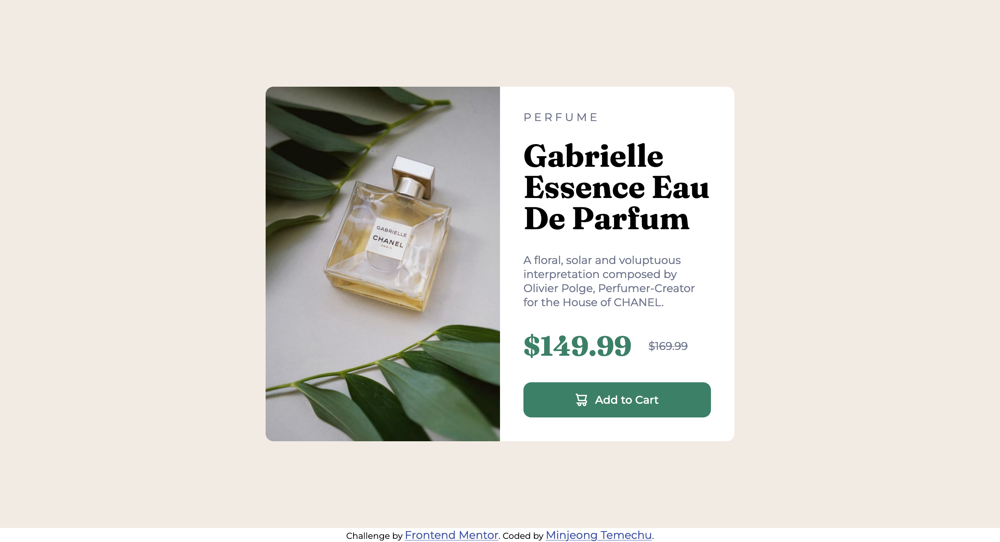

# Frontend Mentor - Product preview card component solution

This is a solution to the [Product preview card component challenge on Frontend Mentor](https://www.frontendmentor.io/challenges/product-preview-card-component-GO7UmttRfa). Frontend Mentor challenges help you improve your coding skills by building realistic projects. 

## Table of contents

- [Overview](#overview)
  - [The challenge](#the-challenge)
  - [Screenshot](#screenshot)
  - [Links](#links)
- [My process](#my-process)
  - [Built with](#built-with)
  - [What I learned](#what-i-learned)


## Overview

### The challenge

Users should be able to:

- View the optimal layout depending on their device's screen size
- See hover and focus states for interactive elements

### Screenshot




### Links

- Solution URL: [Add solution URL here](https://your-solution-url.com)
- Live Site URL: [Add live site URL here](https://your-live-site-url.com)

## My process

### Built with

- Semantic HTML5 markup
- CSS custom properties


### What I learned

I discovered the functionality of flex-basis, which determines the initial size of a flexible item. 
In this project, since the element that has class name 'container' is displayed as flex,
the items inside can have initial length which is flex basis.

By setting both elements' flex-basis length to 50%, I was able to achieve an evenly balanced ratio between them.


```css

.gallery {
    flex-basis: 50%;
   

}


.details {
    flex-basis: 50%;
    padding: 30px;
    
}
```


